# TaskFlow

> ⚠️ **Placeholder de nombre:** el `package.json` todavía dice `hono-spa-spike`. Usé "TaskFlow" acá porque aparece como prefijo en el `localStorage` (`taskflow_offline_tasks`). Cambialo por el nombre final antes de publicar, y actualizá el campo `name` en `package.json` para que coincida.

Gestor de tareas simple con estados, deadlines y detección automática de tareas atrasadas. Full-stack, corriendo 100% en el edge de Cloudflare.

<!-- ⚠️ PLACEHOLDER: agregá acá un GIF o 2-3 screenshots del flujo principal (crear tarea → cambiar estado → ver overdue). Es lo primero que un reclutador mira. -->
<!-- ⚠️ PLACEHOLDER: agregá el link de demo en vivo si tenés uno deployado: **[Ver demo →](https://tu-deploy.pages.dev)** -->

---

## Por qué este proyecto

Es un proyecto de aprendizaje deliberadamente simple en su dominio (un CRUD de tareas), pero usado como excusa para practicar en profundidad un stack moderno de punta a punta: tipado end-to-end entre cliente y servidor, estado reactivo que evita el diffing del Virtual DOM en las mutaciones de valor, autenticación real, y despliegue serverless en el edge.

## Features

- **Tres estados por tarea:** `PENDING` → `IN_PROGRESS` → `COMPLETED`, con cambio de estado en un clic.
- **Deadline opcional** por tarea, con detección automática de tareas **atrasadas** (overdue): una tarea se marca como atrasada si no está completada y su deadline ya pasó — el cálculo es reactivo, se recalcula solo en la UI sin recargar la página.
- **Edición inline** de campos (título, deadline) con patrón *optimistic update*: el cambio se refleja al instante en la UI y se revierte automáticamente si la petición al servidor falla.
- **Persistencia offline básica** en `localStorage` como caché de lectura mientras se resuelve la sincronización con el servidor.
- **Autenticación** con sesión persistente (login / registro / logout) vía Better Auth.
- **PWA instalable**, con service worker generado por Workbox.

## Stack técnico y por qué lo elegí

| Capa | Tecnología | Por qué |
|---|---|---|
| Runtime / Deploy | **Cloudflare Workers + Pages** | Edge-first: latencia baja global, cold-start mínimo, sin servidor que mantener. |
| Framework backend | **Hono** | Liviano, pensado para runtimes edge, con RPC tipado nativo hacia el cliente. |
| Base de datos | **Cloudflare D1** (SQLite) + **Drizzle ORM** | D1 vive en el mismo borde que el Worker; Drizzle da tipado fuerte sobre SQL sin la sobrecarga de un ORM más pesado. |
| Frontend | **Preact** | Misma API que React con un bundle mucho más chico — importante para un SPA que se sirve desde el edge. |
| Estado | **@preact/signals** | Reactividad granular: las mutaciones de valor actualizan el DOM directamente y evitan el ciclo de diffing/reconciliación del Virtual DOM (que Preact sí tiene y usa para el resto del árbol). |
| Routing | **preact-iso** | Router pensado específicamente para el ecosistema Preact/edge. |
| Auth | **Better Auth** | Evita reinventar manejo de sesiones/tokens a mano; cliente tipado propio, separado del RPC de dominio. |
| Validación | **Zod** (vía `@hono/zod-validator`) | Contrato de entrada validado en runtime, con inferencia de tipos hacia el cliente. |
| Estilos | **TailwindCSS v4** (CSS-first, Lightning CSS) | Configuración sin archivo JS, motor nativo más rápido. |
| Lint/format | **Biome** | Reemplaza ESLint + Prettier con una sola herramienta más rápida. |

## Arquitectura

```mermaid
graph TD
    subgraph Browser["Navegador (Cliente)"]
        direction TB
        UI["Componentes Preact (TSX)<br/><i>Signals evitan diffing en mutaciones de valor</i>"]
        State["Stores / Modelos<br/><i>@preact/signals</i>"]
        RPC["Cliente RPC de Hono<br/><i>fetch tipado + AbortSignal</i>"]
        AuthC["Cliente Better Auth<br/><i>cookies de sesión</i>"]

        UI -->|Lee signals / dispara acciones| State
        State -->|Actualiza DOM vía signals| UI
        State -->|Llama métodos tipados| RPC
        State -->|Login / registro / logout| AuthC
    end

    subgraph Edge["Cloudflare (Servidor)"]
        direction TB
        API["Router Hono<br/><i>Validación: Zod</i>"]
        Auth["Better Auth<br/><i>manejo de sesión</i>"]
        ORM["Drizzle ORM"]
        D1[("Cloudflare D1 (SQLite)")]

        API -->|Queries| ORM
        ORM -->|Transacciones| D1
        Auth -->|Persiste sesión/usuario| D1
    end

    RPC ===>|HTTP / JSON, credentials: include| API
    AuthC ===>|HTTP / cookies| Auth
    API -.->|Tipos inferidos: AppType| RPC
    Auth -.->|Tipos inferidos: AuthType| AuthC

    classDef client fill:#e1f5fe,stroke:#0288d1,stroke-width:2px;
    classDef server fill:#efebe9,stroke:#5d4037,stroke-width:2px;
    classDef database fill:#e8f5e9,stroke:#2e7d32,stroke-width:2px;
    class UI,State,RPC,AuthC client;
    class API,Auth,ORM server;
    class D1 database;
```



**Flujo de datos:**
1. Los componentes leen estado de **stores** (globales, ej. sesión) o **modelos** (locales al componente) construidos sobre `@preact/signals`.
2. Las mutaciones de dominio (tareas) pasan por el cliente RPC de Hono (`src/client/lib/api.ts`), tipado a partir de `AppType`, inferido directamente del router del servidor — sin generar ni mantener tipos a mano.
3. Las operaciones de identidad (login, registro, sesión) pasan por un canal separado: el cliente de Better Auth (`src/client/lib/auth-client.ts`), tipado a partir de `AuthType`, inferido del lado del servidor de Better Auth. Es una segunda inferencia de tipos independiente de `AppType`, no una extensión de ella.
4. El servidor valida cada payload del canal RPC con Zod antes de tocar la base, y usa Drizzle para las queries a D1. Better Auth persiste sesión y usuario también en D1, pero por su propio camino.
5. Ambos canales comparten la sesión vía **cookies httpOnly**: el cliente RPC fuerza `credentials: "include"` en cada request para que el navegador las adjunte.

Para el modelo de datos completo, ver [`docs/ERD.md`](./docs/ERD.md) (generado automáticamente desde el schema de Drizzle).

## Estructura del proyecto

```
src/
├── client/
│   ├── components/
│   │   ├── router/       # Guards de autenticación (PrivateRoute, GuestRoute)
│   │   ├── tasks/         # Componentes específicos del dominio de tareas
│   │   └── ui/            # Componentes de UI reutilizables
│   ├── hooks/              # Hooks utilitarios (mutación optimista, prefetch, etc.)
│   ├── lib/                 # Cliente RPC, cliente de auth, factories de modelos
│   ├── pages/               # Vistas mapeadas a rutas
│   ├── stores/               # Estado global (singleton), ej. sesión y tareas
│   └── style.css
└── server/
    ├── auth/                 # Configuración de Better Auth
    ├── db/                    # Schemas de Drizzle
    ├── routes/                 # Endpoints de Hono
    └── validations/             # Schemas de Zod
```

## Notas de build

El proyecto compila a un único deploy de Cloudflare Pages a partir de **dos pasadas de Vite** sobre el mismo `vite.config.ts`: una en modo `client` (genera el SPA en `dist/`) y otra en modo `server` (empaqueta el backend de Hono como `dist/_worker.js` vía `@hono/vite-build/cloudflare-pages`). El script `build` las ejecuta en ese orden. En desarrollo, `@hono/vite-dev-server` sirve ambos desde el mismo proceso, enrutando todo lo que no empiece con `/api` como ruta del SPA.

## Correr el proyecto localmente

```bash
pnpm install
pnpm run dev
```

Aplicar migraciones de base de datos:

```bash
pnpm run db:migrate:local
```

Generar el diagrama de entidad-relación en `docs/ERD.md`:

```bash
pnpm run docs:erd
```

Desplegar a Cloudflare Pages:

```bash
pnpm run deploy
```

### Nota sobre tipos de Cloudflare

El proyecto tiene disponible el script `pnpm run cf-typegen` (que corre `wrangler types`), pero **no se usa** — la decisión fue quedarse con el paquete estático `@cloudflare/workers-types` (fijado como `^4.20260619.1`) en vez de generar tipos por proyecto. Cloudflare recomienda migrar a la generación vía Wrangler, pero el esquema de versionado `4.YYYYMMDD.patch` de esta major ancla los tipos a un snapshot de fecha concreto de `workerd` — el mismo beneficio de precisión que da `wrangler types`, sin el paso extra de regenerarlos. Ojo: la v5 del paquete (julio 2026) eliminó ese anclaje por fecha, así que una actualización a mano más allá de la v4 cambiaría este trade-off.

## Roadmap

### Fase 1: Flujo de Datos Core y Layout Base (Must Have)
- [x] **[DB-001] Ordenamiento Semántico:** Inyección de `CASE WHEN` dinámico y `NULLS LAST` en D1 para garantizar la jerarquía visual de estados y fechas directamente desde el servidor.
- [ ] **[UI-002] Widget de Deadline:** Interfaz de captura (`datetime-local`) y mutación reactiva para la fecha límite de la tarea, asegurando el envío del *String ISO* simétrico consumido por el contrato de Zod (`z.coerce.date()`) en la API. *(Bloqueador de UI-001-B)*.
- [x] **[UI-001-A] Dashboard Layout Base:** purga del ordenamiento local (`.sort()`) y adopción del componente optimizado `<For>` de `@preact/signals/utils`.
- [ ] **[UI-001-B] Ergonomía Táctil Mobile:** Adaptación de áreas de impacto (*touch targets*), truncamiento defensivo de textos y corrección visual de widgets para evitar desbordamientos en pantallas táctiles pequeñas.

### Fase 2: Identidad Periférica y Estabilización (Should Have)
- [ ] **[AUTH-001] OAuth 2.0:** Integración de inicio de sesión con Google Provider vía Better Auth, configurando credenciales de entorno en Cloudflare.
- [ ] **[SYS-001] Debug PWA:** Auditoría de instalación, registro de *Service Worker* y verificación de la estrategia de caché *offline-first*.

### Fase 3: Post-MVP (Won't Have / Pospuesto)
- [ ] **[SYS-002] Migración de Bundler:** Adopción de `@cloudflare/vite-plugin`. Tarea bloqueada intencionalmente hasta el congelamiento del código base para evitar riesgos de compilación en el MVP.

## Licencia

<!-- ⚠️ PLACEHOLDER: elegí una licencia (MIT es lo más común para portafolio) o quitá esta sección -->

# Referencia de Códigos de Error - Better Auth

*Listado completo de códigos de error extraídos de los tipos literales de la librería (`BetterAuthErrorCode`).*

## Autenticación y Credenciales
- `INVALID_PASSWORD`
- `INVALID_EMAIL`
- `INVALID_EMAIL_OR_PASSWORD`
- `CREDENTIAL_ACCOUNT_NOT_FOUND`
- `ACCOUNT_NOT_FOUND`
- `PASSWORD_TOO_SHORT`
- `PASSWORD_TOO_LONG`
- `USER_ALREADY_HAS_PASSWORD`
- `PASSWORD_ALREADY_SET`

## Usuarios y Sesiones
- `USER_NOT_FOUND`
- `INVALID_USER`
- `FAILED_TO_CREATE_USER`
- `FAILED_TO_UPDATE_USER`
- `USER_ALREADY_EXISTS`
- `USER_ALREADY_EXISTS_USE_ANOTHER_EMAIL`
- `FAILED_TO_GET_USER_INFO`
- `FAILED_TO_CREATE_SESSION`
- `FAILED_TO_GET_SESSION`
- `SESSION_EXPIRED`
- `SESSION_NOT_FRESH`

## Verificación y Emails
- `USER_EMAIL_NOT_FOUND`
- `EMAIL_NOT_VERIFIED`
- `EMAIL_CAN_NOT_BE_UPDATED`
- `CHANGE_EMAIL_DISABLED`
- `VERIFICATION_EMAIL_NOT_ENABLED`
- `EMAIL_ALREADY_VERIFIED`
- `EMAIL_MISMATCH`
- `FAILED_TO_CREATE_VERIFICATION`

## Proveedores Sociales (OAuth)
- `SOCIAL_ACCOUNT_ALREADY_LINKED`
- `PROVIDER_NOT_FOUND`
- `LINKED_ACCOUNT_ALREADY_EXISTS`
- `FAILED_TO_UNLINK_LAST_ACCOUNT`

## Tokens y URLs de Retorno (Callbacks)
- `INVALID_TOKEN`
- `TOKEN_EXPIRED`
- `ID_TOKEN_NOT_SUPPORTED`
- `INVALID_ORIGIN`
- `INVALID_CALLBACK_URL`
- `INVALID_REDIRECT_URL`
- `INVALID_ERROR_CALLBACK_URL`
- `INVALID_NEW_USER_CALLBACK_URL`
- `MISSING_OR_NULL_ORIGIN`
- `CALLBACK_URL_REQUIRED`

## Validaciones y Errores Internos de API
- `FIELD_NOT_ALLOWED`
- `ASYNC_VALIDATION_NOT_SUPPORTED`
- `VALIDATION_ERROR`
- `MISSING_FIELD`
- `METHOD_NOT_ALLOWED_DEFER_SESSION_REQUIRED`
- `BODY_MUST_BE_AN_OBJECT`
- `CROSS_SITE_NAVIGATION_LOGIN_BLOCKED`

