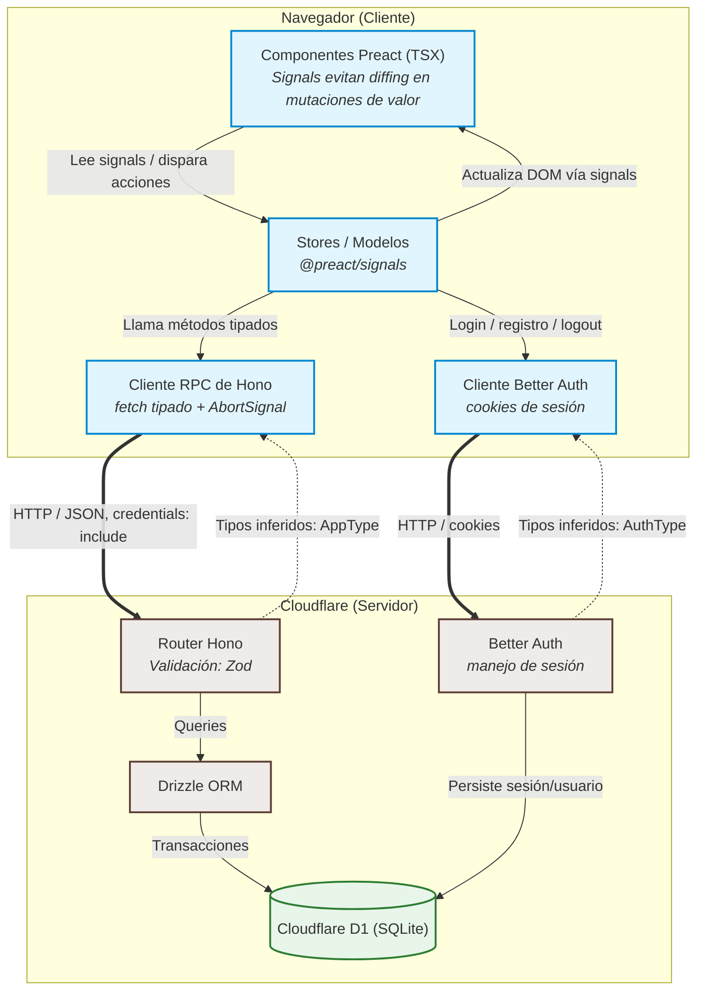

# TaskFlow

Gestor de tareas simple con estados, deadlines y detección automática de tareas atrasadas. Full-stack, corriendo 100% en el edge de Cloudflare.

<!-- ⚠️ PLACEHOLDER: agregá acá un GIF o 2-3 screenshots del flujo principal (crear tarea → cambiar estado → ver overdue). Es lo primero que un reclutador mira. -->
<!-- ⚠️ PLACEHOLDER: agregá el link de demo en vivo si tenés uno deployado: **[Ver demo →](https://tu-deploy.pages.dev)** -->

---

## Por qué este proyecto

Es un proyecto de aprendizaje deliberadamente simple en su dominio (un CRUD de tareas), pero usado como excusa para practicar en profundidad un stack moderno de punta a punta: tipado end-to-end entre cliente y servidor, estado desacoplado del ciclo de render, autenticación real, y despliegue serverless en el edge.

## Features

- **Tres estados por tarea:** `PENDING` → `IN_PROGRESS` → `COMPLETED`, con cambio de estado en un clic.
- **Deadline opcional** por tarea, con detección automática de tareas **atrasadas** (overdue): una tarea se marca como atrasada si no está completada y su deadline ya pasó — el cálculo es reactivo, se recalcula solo en la UI sin recargar la página.
- **Edición inline** de campos (título, deadline) con patrón *optimistic update*: el cambio se refleja al instante en la UI y se revierte automáticamente si la petición al servidor falla.
- **Persistencia offline básica** en `localStorage` como caché de lectura mientras se resuelve la sincronización con el servidor.
- **Autenticación** con sesión persistente (login / registro / logout) vía Better Auth.
- **PWA instalable**, con service worker generado por Workbox.

## Stack técnico y por qué lo elegí

| Capa | Tecnología | Por qué |
|---|---|---|
| Runtime / Deploy | **Cloudflare Pages** (el backend corre como Worker por debajo — ver [Notas de build](#notas-de-build)) | Latencia baja global, sin servidor que mantener, y sobre todo: frontend y backend se despliegan **juntos, automáticamente en cada commit** — no hay que correr un comando de deploy a mano ni coordinar dos despliegues separados. |
| Framework backend | **Hono** | Liviano, pensado para runtimes edge, con RPC tipado nativo hacia el cliente. |
| Base de datos | **Cloudflare D1** (SQLite) + **Drizzle ORM** | D1 comparte el entorno del Worker, sin salto de red hacia un servicio externo; Drizzle da tipado fuerte sobre SQL sin la sobrecarga de un ORM más pesado. |
| Frontend | **Preact** | Misma API que React con un bundle mucho más chico — importante para un SPA que se sirve desde el edge. |
| Estado | **@preact/signals** | Desacopla la lógica del ciclo de render: se puede leer/mutar estado, o disparar un fetch al backend, sin necesitar `useEffect` atado a un componente. Como efecto colateral, las mutaciones de valor también evitan el diffing del Virtual DOM en ese nodo puntual (que Preact sí usa para el resto del árbol). |
| Routing | **preact-iso** | Router pensado específicamente para el ecosistema Preact. |
| Auth | **Better Auth** | Evita reinventar manejo de sesiones/tokens a mano; cliente tipado propio, separado del RPC de dominio. |
| Validación | **Zod** (vía `@hono/zod-validator`) | Contrato de entrada validado en runtime, con inferencia de tipos hacia el cliente. |
| Estilos | **TailwindCSS v4** (CSS-first, Lightning CSS) + **View Transitions API** | Tailwind sin archivo JS, motor nativo más rápido. Transiciones de navegación con la API nativa del navegador, sin librería externa. |
| Lint/format | **Biome** | Reemplaza ESLint + Prettier con una sola herramienta más rápida. |

## Arquitectura



**Flujo de datos:**
1. Los componentes leen estado de **stores** (globales, ej. sesión) o **modelos** (locales al componente) construidos sobre `@preact/signals`.
2. Las mutaciones de dominio (tareas) pasan por el cliente RPC de Hono (`src/client/lib/api.ts`), tipado a partir de `AppType`, inferido directamente del router del servidor — sin generar ni mantener tipos a mano.
3. Las operaciones de identidad (login, registro, sesión) pasan por un canal separado: el cliente de Better Auth (`src/client/lib/auth-client.ts`), tipado a partir de `AuthType`, inferido del lado del servidor de Better Auth. Es una segunda inferencia de tipos independiente de `AppType`, no una extensión de ella.
4. El servidor valida cada payload del canal RPC con Zod antes de tocar la base, y usa Drizzle para las queries a D1. Better Auth persiste sesión y usuario también en D1, pero por su propio camino.
5. Ambos canales comparten la sesión vía **cookies httpOnly**: el cliente RPC fuerza `credentials: "include"` en cada request para que el navegador las adjunte.

Para el modelo de datos completo, ver [`docs/ERD.md`](./docs/ERD.md) (generado automáticamente desde el schema de Drizzle).

## Estructura del proyecto

```
src/
├── client/
│   ├── components/
│   │   ├── router/       # Guards de autenticación (PrivateRoute, GuestRoute)
│   │   ├── tasks/         # Componentes específicos del dominio de tareas
│   │   └── ui/            # Componentes de UI reutilizables
│   ├── hooks/              # Hooks utilitarios (mutación optimista, prefetch, etc.)
│   ├── lib/                 # Cliente RPC, cliente de auth, factories de modelos
│   ├── pages/               # Vistas mapeadas a rutas
│   ├── stores/               # Estado global (singleton), ej. sesión y tareas
│   └── style.css
└── server/
    ├── auth/                 # Configuración de Better Auth
    ├── db/                    # Schemas de Drizzle
    ├── routes/                 # Endpoints de Hono
    └── validations/             # Schemas de Zod
```

## Notas de build

El proyecto compila a un único deploy de Cloudflare Pages a partir de **dos pasadas de Vite** sobre el mismo `vite.config.ts`: una en modo `client` (genera el SPA en `dist/`) y otra en modo `server` (empaqueta el backend de Hono como `dist/_worker.js` vía `@hono/vite-build/cloudflare-pages`). El script `build` las ejecuta en ese orden. En desarrollo, `@hono/vite-dev-server` sirve ambos desde el mismo proceso, enrutando todo lo que no empiece con `/api` como ruta del SPA.

## Variables de entorno

El proyecto necesita un archivo `.dev.vars` en la raíz para desarrollo local (no se versiona — agregado a `.gitignore`). Cloudflare Pages/Workers lo detecta automáticamente vía `wrangler dev`.

```bash
# .dev.vars
BETTER_AUTH_SECRET=<generar con el comando de abajo>
```

Generar un secreto seguro:

```bash
openssl rand -base64 32
```

Para producción/preview, el mismo secreto se configura como variable de entorno **encriptada** en el dashboard de Cloudflare Pages (Settings → Environment variables → Secret), o vía:

```bash
npx wrangler pages secret put BETTER_AUTH_SECRET --project-name taskflow-app
```

**Nunca** commitear este valor ni ponerlo en `wrangler.jsonc` bajo `vars` (esa sección es para variables públicas, no secretas — `wrangler.jsonc` sí se versiona).

## Correr el proyecto localmente

```bash
pnpm install
pnpm run dev
```

Aplicar migraciones de base de datos:

```bash
pnpm run db:migrate:local
```

Generar el diagrama de entidad-relación en `docs/ERD.md`:

```bash
pnpm run docs:erd
```

Desplegar a Cloudflare Pages:

```bash
pnpm run deploy
```

### Nota sobre tipos de Cloudflare

El proyecto tiene disponible el script `pnpm run cf-typegen` (que corre `wrangler types`), pero **no se usa** — la decisión fue quedarse con el paquete estático `@cloudflare/workers-types` (fijado como `^4.20260619.1`) en vez de generar tipos por proyecto. Cloudflare recomienda migrar a la generación vía Wrangler, pero el esquema de versionado `4.YYYYMMDD.patch` de esta major ancla los tipos a un snapshot de fecha concreto de `workerd` — el mismo beneficio de precisión que da `wrangler types`, sin el paso extra de regenerarlos. Ojo: la v5 del paquete (julio 2026) eliminó ese anclaje por fecha, así que una actualización a mano más allá de la v4 cambiaría este trade-off.

## Roadmap

### Fase 1: Flujo de Datos Core y Layout Base (Must Have)
- [x] **[DB-001] Ordenamiento Semántico:** Inyección de `CASE WHEN` dinámico y `NULLS LAST` en D1 para garantizar la jerarquía visual de estados y fechas directamente desde el servidor.
- [ ] **[UI-002] Widget de Deadline:** Interfaz de captura (`datetime-local`) y mutación reactiva para la fecha límite de la tarea, asegurando el envío del *String ISO* simétrico consumido por el contrato de Zod (`z.coerce.date()`) en la API. *(Bloqueador de UI-001-B)*.
- [x] **[UI-001-A] Dashboard Layout Base:** purga del ordenamiento local (`.sort()`) y adopción del componente optimizado `<For>` de `@preact/signals/utils`.
- [ ] **[UI-001-B] Ergonomía Táctil Mobile:** Adaptación de áreas de impacto (*touch targets*), truncamiento defensivo de textos y corrección visual de widgets para evitar desbordamientos en pantallas táctiles pequeñas.
- [ ] **[UI-003] Rollback de Red y Consistencia Local:** Mecanismo de reversión determinista del estado optimista en el modelo ante caídas de la API o fallos de sincronización con el servidor.

### Fase 2: Identidad Periférica y Estabilización (Should Have)
- [ ] **[AUTH-001] OAuth 2.0:** Integración de inicio de sesión con Google Provider vía Better Auth, configurando credenciales de entorno en Cloudflare.
- [ ] **[SEO-001] Landing SSG + Mover ruta raíz:** Prerenderizar una landing pública vía `preact-iso` (`additionalPrerenderRoutes`), moviendo `/` de la pantalla de login hacia la landing y reubicando el login en `/login`. Actualizar guards (`GuestRoute`/`PrivateRoute`) y redirects hardcodeados a `/`.
- [ ] **[PWA-002] Fijar `start_url` del manifest:** Definir `start_url: "/login"` explícito (o la ruta real de entrada a la app) para que la PWA instalada abra la app, no la landing, una vez migrada la ruta raíz. *(Depende de SEO-001)*.
- [ ] **[PWA-003] Excluir la landing del runtime caching:** Agregar regla `NetworkOnly` para la ruta de la landing en `pwa.config.ts`, ubicada *antes* de la regla `NetworkFirst` genérica de navegación, para que nunca participe del sistema de caché offline (no cumple función offline). *(Depende de SEO-001)*.
- [ ] **[SEO-002] Verificar fallback de rutas post-migración:** Confirmar que el fallback de Hono (`app.all("*", ...)`) siga sirviendo el shell genérico de la SPA para todo lo que no sea la landing, sin que el HTML prerenderizado de `/` contamine otras rutas (deep-links). *(Depende de SEO-001)*.
- [ ] **[SYS-001] Debug PWA:** Auditoría de instalación, registro de *Service Worker* y verificación de la estrategia de caché *offline-first*.
- [ ] **[PWA-004] Personalizar manifest:** `name`/`description` del manifest siguen siendo texto genérico de boilerplate ("Hono SPA Template"), no específico de TaskFlow.
- [ ] **[SYS-003] Sincronización Reactiva de Ordenamiento:** Implementación de la lógica de reordenamiento derivado en caliente en el cliente, apalancada en la *View Transitions API* para animar de forma fluida las mutaciones locales sin alterar la fuente de verdad del servidor.

### Fase 3: Post-MVP (Won't Have / Pospuesto)
- [ ] **[SYS-002] Migración de Bundler:** Adopción de `@cloudflare/vite-plugin` en reemplazo de `@hono/vite-build` y `@hono/vite-dev-server` (paridad real con el runtime de Workers en dev, vía `workerd`/Miniflare, en vez de la aproximación actual sobre Node). Tarea bloqueada intencionalmente hasta el congelamiento del código base para evitar riesgos de compilación en el MVP.

## Licencia

<!-- ⚠️ PLACEHOLDER: elegí una licencia (MIT es lo más común para portafolio) o quitá esta sección -->