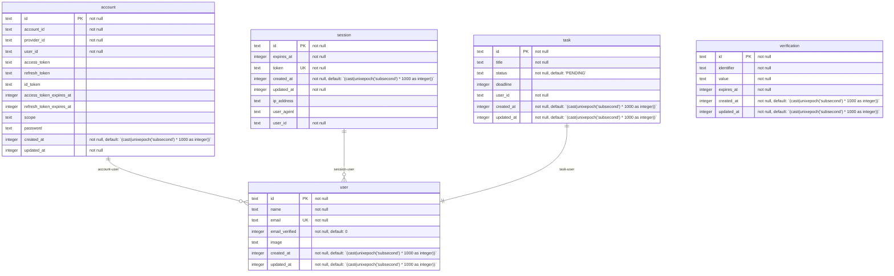

# Diagrama Entidad-Relación (DER)

```mermaid
erDiagram

    account {
        text id PK "not null"
        text account_id "not null"
        text provider_id "not null"
        text user_id "not null"
        text access_token
        text refresh_token
        text id_token
        integer access_token_expires_at
        integer refresh_token_expires_at
        text scope
        text password
        integer created_at "not null, default: `(cast(unixepoch('subsecond') * 1000 as integer))`"
        integer updated_at "not null"
    }
    session {
        text id PK "not null"
        integer expires_at "not null"
        text token UK "not null"
        integer created_at "not null, default: `(cast(unixepoch('subsecond') * 1000 as integer))`"
        integer updated_at "not null"
        text ip_address
        text user_agent
        text user_id "not null"
    }
    task {
        text id PK "not null"
        text title "not null"
        text status "not null, default: 'PENDING'"
        integer deadline
        text user_id "not null"
        integer created_at "not null, default: `(cast(unixepoch('subsecond') * 1000 as integer))`"
        integer updated_at "not null, default: `(cast(unixepoch('subsecond') * 1000 as integer))`"
    }
    user {
        text id PK "not null"
        text name "not null"
        text email UK "not null"
        integer email_verified "not null, default: 0"
        text image
        integer created_at "not null, default: `(cast(unixepoch('subsecond') * 1000 as integer))`"
        integer updated_at "not null, default: `(cast(unixepoch('subsecond') * 1000 as integer))`"
    }
    verification {
        text id PK "not null"
        text identifier "not null"
        text value "not null"
        integer expires_at "not null"
        integer created_at "not null, default: `(cast(unixepoch('subsecond') * 1000 as integer))`"
        integer updated_at "not null, default: `(cast(unixepoch('subsecond') * 1000 as integer))`"
    }
account ||--o{ user : "account-user"
session ||--o{ user : "session-user"
task ||--|| user : "task-user"
```
